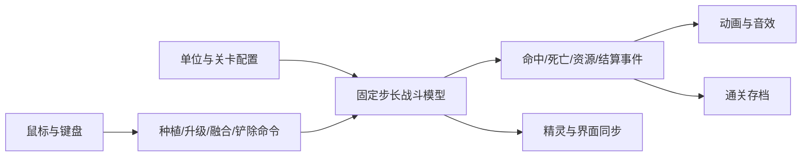

# 实现方案

日期：2026-09-05｜状态：建议方案，尚未创建工程或安装依赖。

## 1. 两种“改版”的区别

| 路线 | 做法 | 好处 | 代价与适用条件 |
| --- | --- | --- | --- |
| 直接修改原版 | 对具体游戏版本的资源、数据或逻辑做调整 | 保留原版表现与手感 | 依赖平台、版本、可用工具和修改接口；未获得具体版本，暂不能判断可修改范围 |
| 独立开发相似玩法 | 自建战斗逻辑、界面和内容 | 规则自由、便于新增机制和调试 | 需要自行完成动画、音效、战斗手感和数值 |

当前建议独立开发，因为需求尚未绑定原版版本，且目标是制作自己的改版。该选择是工程判断，不是用户已确认的限制。

## 2. 技术路线比较

| 技术 | 适合情况 | 本项目取舍 |
| --- | --- | --- |
| Phaser + TypeScript + Vite | 浏览器 2D 游戏，快速分享试玩 | 推荐，游戏画面交给 Phaser，业务逻辑用 TypeScript |
| Godot + GDScript | 喜欢可视化场景编辑，桌面/移动端优先 | 可作为平台改为原生应用时的候选；Web 导出须验证对应版本限制 |
| 原生 Canvas + TypeScript | 极简演示或学习底层渲染 | 需要额外实现资源、动画与场景管理，本项目收益有限 |

Phaser 官方说明其支持 JavaScript/TypeScript，以及 WebGL/Canvas 浏览器渲染。这与当前网页 2D 原型目标匹配。[官方文档](https://docs.phaser.io/)

Godot 提供 Web 导出，但对应版本的浏览器、渲染和音频限制需要实机验证，不能直接假设与桌面导出一致。[官方 Web 导出说明](https://docs.godotengine.org/en/stable/tutorials/export/exporting_for_web.html)

不在此阶段固定具体依赖版本；建工程时核对稳定版本与模板兼容性，锁定依赖和锁文件。框架版本变化不应影响独立的战斗模型。

首版不需要后端或数据库；使用静态资源和 localStorage。复杂账号与联网能力不在当前需求中。

## 3. 工程结构建议

以下是后续代码布局，当前仅创建文档目录：

```text
src/
  main.ts
  game/
    scenes/       # Boot、Menu、LevelSelect、Battle、Result
    simulation/   # 战斗状态、固定步长更新、命令处理
    systems/      # 生产、索敌、移动、攻击、碰撞、死亡、波次
    entities/     # Plant、Enemy、Projectile、Sun、DefenseCar
    data/         # 植物、敌人、关卡、进化配置及校验
    view/         # 模型到精灵的同步、动画和特效
    ui/           # 卡片、资源条、暂停和升级面板
    services/     # 音频、存档、带种子随机数
tests/
public/assets/
docs/
```

采用简单实体集合与系统函数，不为少量单位引入复杂 ECS。战斗计算不直接依赖精灵对象，方便单独测试和替换美术。

## 4. 战斗架构



### 时间与更新顺序

- 模拟使用固定 1/60 秒步长，以累计器衔接渲染；每帧最多补 5 步，超额丢弃并记录调试指标，避免卡顿后无限追赶。
- 所有伤害、生产、波次和冷却使用模拟时间，不依赖各自的 setInterval。
- 每步依次处理：输入命令 → 波次/生产 → 索敌与敌人移动 → 攻击与子弹 → 伤害与死亡 → 防线与胜负 → 输出视图事件。
- 敌人移动做扫掠接触检查，先处理植物阻挡和防线车触发，不能跨越触发线后漏检。
- 实体死亡先标记，步末统一清理；本步后续系统必须排除已死亡实体。
- 暂停、窗口失焦或恢复时重置累计器，不补算离开期间的时间。
- 状态：menu / running / paused / won / lost；结算只能从 running 进入一次。

### 定位与碰撞

- 战斗模型使用格坐标和连续横坐标，视图转换为像素；缩放只改变显示，不改变战斗规则。
- 敌人按行分组，子弹仅检查同行候选目标。用上一帧到当前帧的线段检查命中，避免高速穿透。
- 爆炸取触发时范围内有效目标快照，棋盘边缘裁切范围，每个目标只处理一次。
- 减速使用倍率与失效时间；同类效果取更强倍率并刷新时长，不做无限叠乘，最低移动倍率暂定 0.5。
- 防线车带独立位置和激活状态，沿途扫掠清除敌人；每行车离场后不可重新激活。

### 数据与扩展

| 配置 | 关键字段 |
| --- | --- |
| PlantDefinition | id、cost、hp、cardCooldown、behavior、attackInterval、damage、assetKey |
| EnemyDefinition | id、hp、speed、attackInterval、damage、assetKey |
| EvolutionDefinition | id、basePlantId、cost、resultDefinitionId |
| FusionDefinition | id、ingredientIds（二元素无序对）、extraCost、resultDefinitionId |
| LevelDefinition | id、initialSun、availablePlantIds、waves、nextLevelId |
| WaveDefinition | spawnAt、enemyId、row；批次在载入时展开为生成事件 |
| SaveData | schemaVersion、unlockedLevelIds、completedLevelIds、audioSettings |

基础属性放配置，能力由少量行为处理器实现；不把可执行代码字符串写进关卡数据。载入时检查 ID 唯一、引用存在、路线合法、数值非负。

种植、升级和融合通过命令统一校验、扣款和修改状态，防止重复点击导致重复扣款。实体使用稳定唯一 ID，表现层销毁不承担游戏判定。

## 5. 美术与音频方案

原型采用原创几何图形或简单卡通占位：颜色区分角色功能，血条和受击反馈保证可读性。战斗比例和格子尺寸稳定后再制作精灵动画。

MVP 资产预计：1 张场景、6 种基础植物、4 种进化形态和 3 种杂交形态、4 种敌人、卡片图标、阳光/子弹/防线车、命中与爆炸特效、按钮和基础音效。动画数量在制作前按角色动作清单估算，不能把一个角色等同于一张图片。

素材清单记录来源与使用许可；正式发布素材采用自制或明确允许使用的资源。当前不把原版素材包作为工程依赖。

## 6. 存档、运行与发布

- localStorage 保存小型带版本 JSON；读取捕获异常并校验字段，失败回退默认值。
- 仅关卡胜利和设置变更时写入；写入失败不终止战斗。
- 后续开发提供安装、启动、测试、构建脚本；此阶段尚无这些可执行命令。
- 构建产物部署为静态站点；公开部署在有可玩版本后再安排。
- 首屏显示加载进度与失败重试；音频在首次用户交互后解锁。

## 7. 主要难点

1. 手感：索敌延迟、攻击动画与实际伤害一致，受击必须可辨认。
2. 节奏：资源增长、布阵成本与敌人压力共同决定体验，不能只加血量提高难度。
3. 内容规模：每个新增植物都会增加动画、测试与平衡成本，进化形态同样计入。
4. 状态清理：重开和场景切换统一释放实体、订阅、输入与音效。
5. 进化差异：控制分支与高输出分支必须有不同适用场景，避免某个选项全面占优。
6. 杂交事务：二次确认时重新校验两株材料，整体执行或整体拒绝；首版禁止进化与杂交递归叠加。

优先解决顺序：完整战斗循环 → 稳定规则 → 特色机制 → 内容 → 美术表现。
